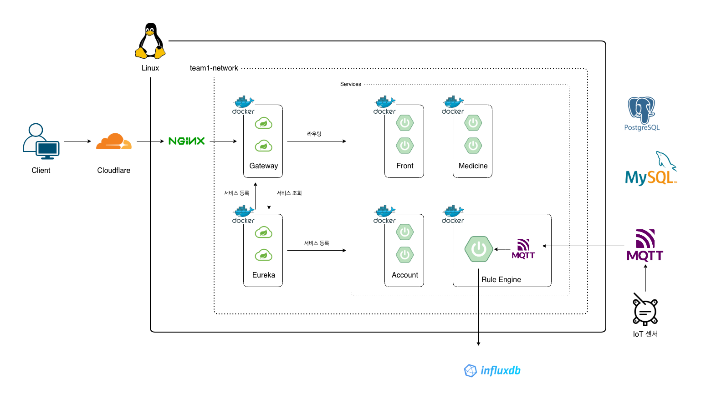

# 💊 iUnoT
> IoT 기반 의약품 재고 및 보관 환경 관리 서비스

의약품의 재고 관리와 보관 환경 모니터링을 제공하는 기관 단위 관리 플랫폼입니다.

IoT 센서 데이터를 활용하여 의약품 보관 환경을 관리하고,

유통기한 및 재고 변동 이력을 기반으로 안정적인 의약품 관리 환경을 제공하는 것을 목표로 합니다.

 

## 🧑‍💻 Team

| 강병호 | 고나영 | 마지희 | 박준원 | 임성준 | 정다빈 | 정영우 | 홍보람 |
|:---:|:---:|:---:|:---:|:---:|:---:|:---:|:---:|
|  |  |  | | | | |
| 인프라 | 조직 | 재고관리 | 룰엔진 | 인증/인가 | 룰엔진 | 인프라 ? 재고관리 ? | 재고관리 |

 

## 🌐 System Architecture

 

## 🗄 ERD (Entity Relationship Diagram)

 

## 📋 Requirements

### 👤 회원 및 조직

- 회원가입, 계정 조회·수정·탈퇴
- 비밀번호 재설정 및 비활성 계정 복구
- 초대 기반 조직 생성과 조직 가입
- 조직원 역할 및 업무 권한 관리
- 조직별 데이터 접근 제한

### 🏢 저장소 및 구역

- 조직별 저장소 관리
- 저장소별 보관 구역 관리
- 구역별 센서 임계값 및 지속 시간 설정
- 사용 중인 저장소·구역 삭제 제한

### 📦 의약품 재고

- 의약품 기준정보 저장 및 검색
- 제조번호·유통기한·위치 단위 입고
- 전체 재고 집계 및 상세 조회
- 재고 출고와 변동 이력 관리
- 재고 부족·유통기한·환경 검토 상태 관리

### 🌡 환경 모니터링

- 실제·가상 센서 데이터 수집
- 센서 데이터 표준화 및 검증
- InfluxDB 시계열 저장
- 위치·센서별 임계값과 지속 시간 판단
- 이상 환경 알림 및 재고 검토 연계

### 📊 Dashboard

- 조직별 재고 현황
- 저장소·구역별 환경 상태
- 재고 부족 및 유통기한 현황
- 환경 이상 발생·해결 기록
- 최근 입고·출고 및 재고 변동 내역

 

## 🛠️ Tech Stack

<a href="#top">▲</a>

