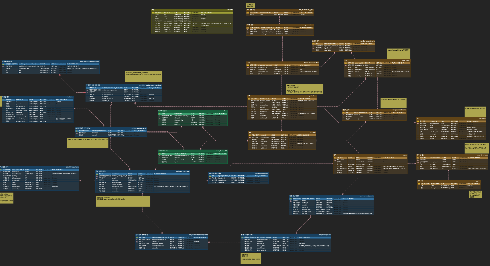

# 💊 iUnoT

> ####  IoT 기반 의약품 재고 및 보관 환경 관리 서비스
|                                     강병호                                      |                                      고나영                                      |                                      마지희                                       | 박준원 | 임성준 | 정다빈 |                                      정영우                                       |                                      홍보람                                       |
|:----------------------------------------------------------------------------:|:-----------------------------------------------------------------------------:|:------------------------------------------------------------------------------:|:---:|:---:|:---:|:------------------------------------------------------------------------------:|:------------------------------------------------------------------------------:|
|  |  |  |  |  |  |  |  |
|                                     인프라                                      |                                     조직관리                                      |                                      재고관리                                      | 룰 엔진 | 인증/인가 | 룰 엔진 |                                      재고관리                                      |                                      재고관리                                      |

---

## 🧑‍💻 프로젝트 소개

#### 기간 : 2026.07.06 ~ 2026.09.xx

- iUnoT는 IoT 센서를 활용하여 의약품의 보관 환경과 재고를 통합 관리하는 기관 단위 플랫폼입니다.

- 실시간 환경 데이터를 기반으로 안전한 보관 환경을 유지하고, 
- 제조번호(Lot) 및 유통기한 기반의 재고 관리와 환경 이상 발생 시 영향 의약품 식별 기능을 제공하여 효율적인 의약품 운영을 지원합니다.

### 핵심 목표
- IoT 기반 환경 데이터와 재고 정보를 통합 관리
- 제조번호(Lot) 및 유통기한 기반 재고 추적
- 환경 이상 발생 시 영향 의약품 식별
- 기관 단위 권한 기반 데이터 관리 체계 구축

### Tech Stack

| Category | Stack |
|----------|-------|
| **Backend** |      |
| **Database** |      |
| **Messaging** |  |
| **Infrastructure** |      |
| **Frontend** |    |
| **AI** |  |
---

## 📋 주요 기능

### 회원 및 조직 관리

- 회원가입 및 계정 관리
- 조직 생성 및 초대 기반 가입
- 조직원 역할 및 권한 관리
- 조직별 데이터 접근 제어

---

### 저장소 및 구역 관리

- 조직별 저장소 및 보관 구역 관리
- 구역별 환경 기준값 설정
- 의약품 보관 위치 관리

---

### 의약품 재고 관리

- 의약품 기준정보 관리
- 제조번호(Lot) 및 유통기한 기반 재고 관리
- 입고·출고 및 재고 변동 이력 관리
- 재고 부족 및 유통기한 임박 알림

---

### 환경 모니터링

- 센서 데이터 수집 및 조회
- 온도·습도·조도·문 열림 상태 모니터링
- 임계값 기반 이상 감지 및 알림

---

### 환경 기반 의약품 관리

- 환경 이상과 의약품 정보 연계
- 영향 가능 의약품 식별
- 검토 및 조치 이력 관리

---

### 대시보드

- 재고 및 유통기한 현황
- 저장소·구역별 환경 상태
- 환경 이상 및 재고 변동 이력 조회

---

## 🌐 시스템 구조
> MSA 기반 구조로 구성되며, Gateway를 통해 인증, 조직, 재고, 룰 엔진 등의 서비스를 분리하여 제공합니다.

 

---

## 🗄 ERD
> 🚧 현재 설계 보완 중이며 지속적으로 업데이트됩니다.

 

---

## 📚 Documentation

| 문서 | 설명 |
|:---:|:---|
| [요구사항](https://github.com/nhnacademy-aiot3-iUnoT/docs) | 서비스 요구사항 정의 |
| [기능명세](https://github.com/nhnacademy-aiot3-iUnoT/docs/tree/docs/%EA%B8%B0%EB%8A%A5%20%EB%AA%85%EC%84%B8) | 기능 명세서 |
| [목업](https://github.com/nhnacademy-aiot3-iUnoT/docs/tree/docs/%EB%AA%A9%EC%97%85) | 목업 문서화 |
| API Docs | REST Docs (예정) |
---
